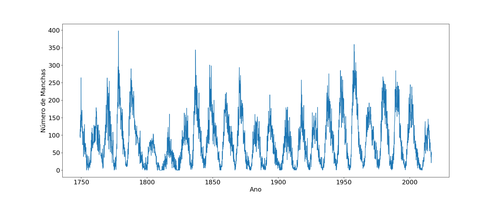
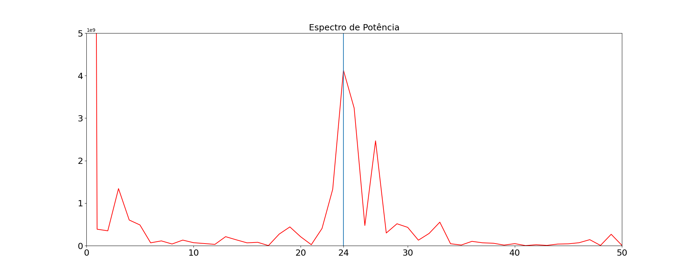

# Análise de Manchas Solares com FFT

Este projeto realiza uma análise temporal da atividade solar utilizando dados históricos de manchas solares e a Transformada Rápida de Fourier (FFT).

O objetivo é identificar ciclos periódicos presentes na atividade solar, especialmente o ciclo solar de aproximadamente 11 anos.

---

# Tecnologias Utilizadas

- Python
- NumPy
- Matplotlib

---

# Funcionamento do Código

O programa:

1. Carrega os dados do arquivo `sunspots.txt`;
2. Separa os dados de tempo e número de manchas solares;
3. Gera um gráfico temporal da atividade solar;
4. Calcula a FFT dos dados;
5. Constrói o espectro de potência;
6. Detecta o pico dominante do espectro;
7. Calcula o período correspondente ao ciclo solar.

---

# Gráfico do Número de Manchas Solares

O gráfico abaixo mostra a variação da quantidade de manchas solares ao longo do tempo.

<p align="center">
  
</p>

É possível observar oscilações periódicas na atividade solar, indicando a existência de ciclos naturais.

---

# Espectro de Potência

Após aplicar a FFT, o espectro de potência revela quais frequências possuem maior intensidade nos dados.

<p align="center">
  
</p>

O pico dominante do espectro corresponde ao principal ciclo periódico presente na atividade solar.

---

# Interpretação Física

A Transformada de Fourier converte os dados do domínio do tempo para o domínio das frequências.

O pico encontrado no espectro representa a frequência dominante do sistema.

A partir dessa frequência, o programa calcula o período do ciclo solar:

```python
periodo_pico = 1 / freqs[k_pico]
