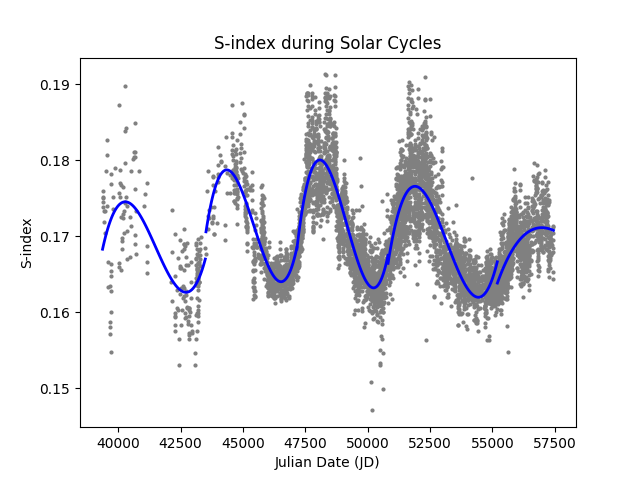

# Análise do Índice S e Ciclos Solares

Este projeto realiza uma análise temporal da atividade solar utilizando dados históricos do índice S (S-index), extraídos de arquivos FITS.

O objetivo é identificar e visualizar os ciclos solares presentes nos dados, cobrindo o período de 1966 a 2016.

- O código que deve ser executado é o graphic.py

---

# Tecnologias Utilizadas

- Python
- NumPy
- Matplotlib
- Astropy
- SciPy

---

# Estrutura dos Arquivos

| Arquivo | Descrição |
|---|---|
| `sindex.fit` | Dados históricos do índice S em formato FITS |
| `reader.py` | Leitura do arquivo FITS e separação por ciclo solar |
| `converter.py` | Funções de conversão entre Julian Date e data calendário |
| `graphic.py` | Geração dos gráficos com spline por ciclo |
| `requirements.txt` | Dependências do projeto |

---

# Funcionamento do Código

O programa:

1. Carrega os dados do arquivo `sindex.fit` via Astropy;
2. Converte as datas de Julian Date para ano calendário;
3. Filtra os dados conforme o período escolhido pelo usuário;
4. Separa as observações em ciclos solares (Ciclos 20 a 24);
5. Gera um gráfico de dispersão do índice S ao longo do tempo;
6. Aplica uma spline suavizada sobre cada ciclo solar individualmente.

---

# Gráfico do Índice S

O gráfico abaixo mostra a variação do índice S ao longo do tempo, com uma curva spline ajustada para cada ciclo solar.

  

É possível observar as variações periódicas da atividade cromosférica solar ao longo dos ciclos.

---

# Ciclos Solares Identificados

| Ciclo | Período Aproximado |
|---|---|
| Ciclo 20 | 1965 – 1977 |
| Ciclo 21 | 1976 – 1987 |
| Ciclo 22 | 1986 – 1997 |
| Ciclo 23 | 1996 – 2009 |
| Ciclo 24 | 2008 – 2016 |

---

# Interpretação Física

O índice S mede a emissão cromosférica do Sol nas linhas Ca II H e K, sendo um indicador direto da atividade magnética solar.

Valores mais altos do índice S correspondem a períodos de maior atividade solar, associados a maior número de manchas solares e eventos de ejeção de massa coronal.

A curva spline ajustada sobre cada ciclo permite visualizar a tendência geral da atividade ao longo de cada período, destacando os máximos e mínimos solares.
