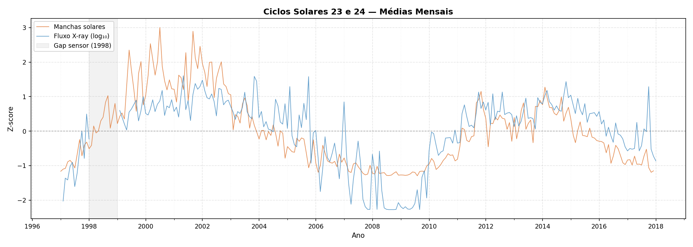
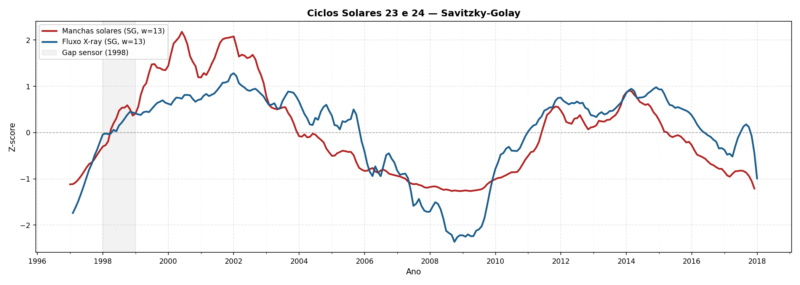
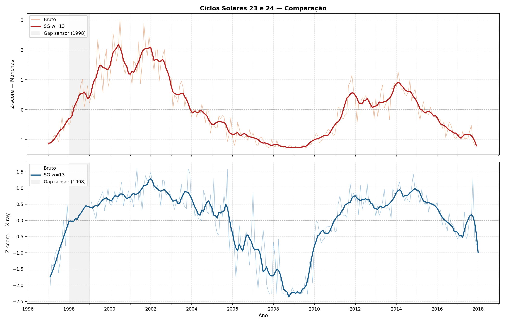

# Análise dos Ciclos Solares 23 e 24

Este projeto realiza uma análise comparativa da atividade solar nos Ciclos 23 e 24 (1997–2017), cruzando dois indicadores independentes: o número de manchas solares e o fluxo de raios X (GOES/XRS).

O objetivo é identificar e visualizar a correlação entre os dois sinais ao longo do tempo, aplicando normalização por Z-score e suavização por filtro Savitzky-Golay.

---

# Tecnologias Utilizadas

- Python
- Pandas
- NumPy
- Matplotlib
- SciPy
- SunPy

---

# Estrutura dos Arquivos

| Arquivo | Descrição |
|---|---|
| `goes.py` | Download automático dos dados GOES/XRS via SunPy (1997–2017) |
| `plots.py` | Processamento dos dados e geração dos três gráficos |
| `dados/daily_Sunspots(97-17).csv` | Dados diários de manchas solares (SIDC) |
| `dados/daily_xray(97-17).csv` | Dados diários de fluxo X-ray (GOES) |
| `requirements.txt` | Dependências do projeto |

---

# Funcionamento do Código

### `goes.py`
1. Realiza o download dos dados GOES/XRS ano a ano via `Fido` (SunPy);
2. Normaliza os nomes das colunas entre versões diferentes do instrumento;
3. Filtra valores fisicamente impossíveis;
4. Agrega os dados para resolução diária;
5. Salva o resultado consolidado em `goes_1997_2017.csv`.

### `plots.py`
1. Carrega os dados de manchas solares e fluxo X-ray;
2. Calcula médias mensais para ambas as séries;
3. Aplica Z-score para normalizar as escalas;
4. Suaviza os dados com filtro Savitzky-Golay (janela 13, grau 3);
5. Gera três gráficos e os salva na pasta `gráficos/`.

---

# Gráficos Gerados

### Médias Mensais (Bruto)

Sobreposição direta dos dois sinais normalizados, sem suavização.

  

---

### Savitzky-Golay

Ambos os sinais suavizados, revelando a tendência de longo prazo de cada ciclo.

  

---

### Comparação Bruto × Suavizado

Painéis separados por indicador, mostrando o sinal bruto e a curva suavizada sobrepostos.

  

---

# Nota sobre o Gap de 1998

A região sombreada em cinza nos gráficos indica um período de ausência de dados do sensor GOES em 1998. Os valores faltantes no fluxo X-ray foram interpolados temporalmente antes da suavização, e meses com menos de 10 observações válidas foram descartados.

---

# Interpretação Física

O **número de manchas solares** é o indicador clássico da atividade magnética fotosférica, enquanto o **fluxo de raios X** (banda GOES B, 1–8 Å) reflete a atividade da coroa solar e a frequência de flares.

A alta correlação entre os dois sinais confirma que ambos são manifestações do mesmo ciclo magnético de ~11 anos. O Ciclo 23 apresentou máximo por volta de 2001–2002, seguido de mínimo prolongado (~2008–2009), e o Ciclo 24 atingiu máximo mais fraco em torno de 2014, caracterizando um ciclo de menor intensidade.
